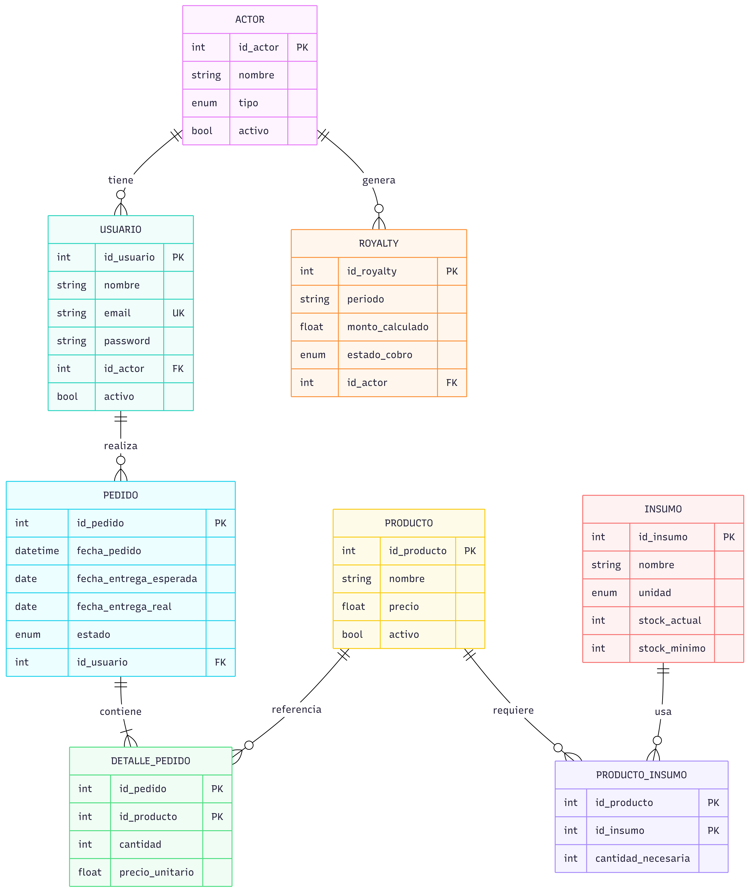

# Panificadora Industrial "La Espiga de Oro S.R.L."

Aplicación web desarrollada con Node.js y Express para la gestión de pedidos, producción, insumos y royalties de la Panificadora Industrial "La Espiga de Oro S.R.L.".

IFTS 29 - Backend


## Descripción del caso

La Espiga de Oro S.R.L. es una fábrica de panificados con **cinco sucursales propias** y una red de **diez franquicias**, donde una planta central concentra toda la producción. Actualmente los pedidos se gestionan de forma informal (mensajería, llamados), lo que genera desconexión entre los actores y dificulta la planificación productiva.

Este sistema busca resolver esa problemática mediante:

- Un **portal de pedidos estructurado** para franquiciados y sucursales.
- **Gestión de estados** del pedido: `PENDIENTE → EN_PRODUCCION → DESPACHADO → ENTREGADO`.
- **Consolidación de demanda** para planificar la producción y compra de insumos.
- **Detección de retrasos** en la entrega.
- **Seguimiento de royalties** para franquiciados.


## Diagrama de Entidad-Relación (DER)



| Enum | Valores |
|------|---------|
| `ACTOR.tipo` | `PLANTA`, `SUCURSAL`, `FRANQUICIA` |
| `PEDIDO.estado` | `PENDIENTE`, `EN_PRODUCCION`, `DESPACHADO`, `ENTREGADO` |
| `INSUMO.unidad` | `GRAMOS`, `MILILITROS`, `UNIDADES` |
| `ROYALTY.estado_cobro` | `PENDIENTE`, `COBRADO` |

## Tecnologías

- **Runtime:** Node.js
- **Framework:** Express.js
- **Motor de plantillas:** Pug
- **Base de datos:** MongoDB
- **ODM:** Mongoose
- **Variables de entorno:** dotenv
- **Arquitectura:** MVC (Modelo - Vista - Controlador) con capa de servicios, separación modular y POO
- **Testing:** Thunder Client


## Arquitectura

El proyecto aplica una arquitectura **MVC (Modelo - Vista - Controlador)** con separación modular por responsabilidad. Además de modelos, vistas y controladores, se incorporan capas de **rutas**, **middlewares**, **servicios** y **validators** para mantener la lógica reutilizable y evitar duplicación entre la API JSON y la interfaz web.
 
| Capa | Carpeta | Responsabilidad |
|---|---|---|
| **Modelos** | `/src/models` | Schemas y modelos Mongoose, como `Actor`, `Pedido` y `Producto` |
| **Vistas** | `/src/views` | Plantillas Pug usadas por la interfaz web |
| **Controladores API** | `/src/controllers/api` | Reciben requests HTTP y responden JSON con códigos adecuados |
| **Controladores Web** | `/src/controllers/web` | Reciben requests desde formularios y renderizan vistas o redirecciones |
| **Servicios** | `/src/services` | Centralizan acceso a datos y lógica reutilizable entre API y Web |
| **Rutas API** | `/src/routes/api` | Definen endpoints REST, por ejemplo `/api/actores`, `/api/pedidos` y `/api/productos` |
| **Rutas Web** | `/src/routes/web` | Definen pantallas y formularios, por ejemplo `/actores`, `/pedidos` y `/productos` |
| **Middlewares API** | `/src/middlewares/api` | Validan datos de entrada y responden errores en formato JSON |
| **Middlewares Web** | `/src/middlewares/web` | Validan formularios y vuelven a renderizar la vista con mensajes de error |
| **Validators** | `/src/validators` | Reglas reutilizables de validación y helpers de respuesta |
| **Config** | `/src/config` | Configuración de infraestructura, como la conexión a MongoDB |
| **Lib** | `/src/lib` | Utilidades compartidas, como helpers de fechas |
| **Persistencia** | MongoDB | Colecciones administradas mediante modelos Mongoose |


## Persistencia con MongoDB

El proyecto fue migrado desde archivos JSON locales a **MongoDB** usando **Mongoose** como ODM. La conexión se inicializa al arrancar la aplicación desde `src/config/db.js`, tomando la URI desde la variable de entorno `MONGO_URI`.

Cambios principales de la migración:

- Se eliminaron los archivos `.json` de `/data` como fuente de persistencia.
- Los modelos `Actor`, `Pedido` y `Producto` ahora son schemas de Mongoose.
- Los ids pasaron a ser `_id` de MongoDB, manejados como `ObjectId`.
- `Pedido` referencia a `Actor` mediante el campo `actor`.
- Los servicios usan operaciones de MongoDB como `find`, `findById`, `findByIdAndUpdate`, `findByIdAndDelete` y `populate`.
- Se validan ids con `mongoose.isValidObjectId` antes de consultar la base.


## Asincronía y ECMAScript

El proyecto utiliza JavaScript moderno con configuración `"type": "module"` en `package.json`, por lo que los módulos se organizan mediante `import` y `export`.

También se aplican recursos de ECMAScript moderno en distintas capas del proyecto:

- `const` para declarar referencias que no se reasignan.
- Arrow functions para servicios, controladores, middlewares y helpers.
- Destructuring para tomar datos de `req.body` y `req.params`.
- Spread operator para construir objetos y actualizar datos sin duplicar estructura.
- `Promise.all` para resolver en paralelo consultas independientes.
- Template literals para mensajes y títulos dinámicos.


## Estructura del proyecto

```
ifts-29-backend-tp-panificadora/
├── src/
│   ├── config/
│   ├── controllers/
│   │   ├── api/
│   │   └── web/
│   ├── lib/
│   ├── middlewares/
│   │   ├── api/
│   │   └── web/
│   ├── models/
│   ├── routes/
│   │   ├── api/
│   │   └── web/
│   ├── services/
│   ├── validators/
│   ├── views/
│   │   ├── actores/
│   │   ├── pedidos/
│   │   └── productos/
│   │   └── common/
│   │   └── mixins/
│   └── app.js
├── docs/
│   └── der.png
├── package.json
└── README.md
```


## Instalación y ejecución

### Requisitos previos

- Node.js v20.19 o superior
- npm
- MongoDB local o una instancia remota, por ejemplo MongoDB Atlas

### Pasos

```bash
# Clonar el repositorio
git clone https://github.com/fazcue/ifts-29-backend-tp-panificadora.git

# Ingresar al directorio
cd ifts-29-backend-tp-panificadora

# Instalar dependencias
npm install

# Crear y configurar el archivo .env con MONGO_URI

# Iniciar el servidor
npm start
```

El servidor corre por defecto en `http://localhost:3000`.

### Variables de entorno

Crear un archivo `.env` en la raíz del proyecto con las siguientes variables:

```env
MONGO_URI=mongodb://127.0.0.1:27017/panificadora
PUERTO=3000
```

`PUERTO` es opcional. Si no se define, la aplicación usa `3000`.

### Modo desarrollo

```bash
npm run dev
```


## Integrantes
- [Facundo Azcue](https://github.com/fazcue)
